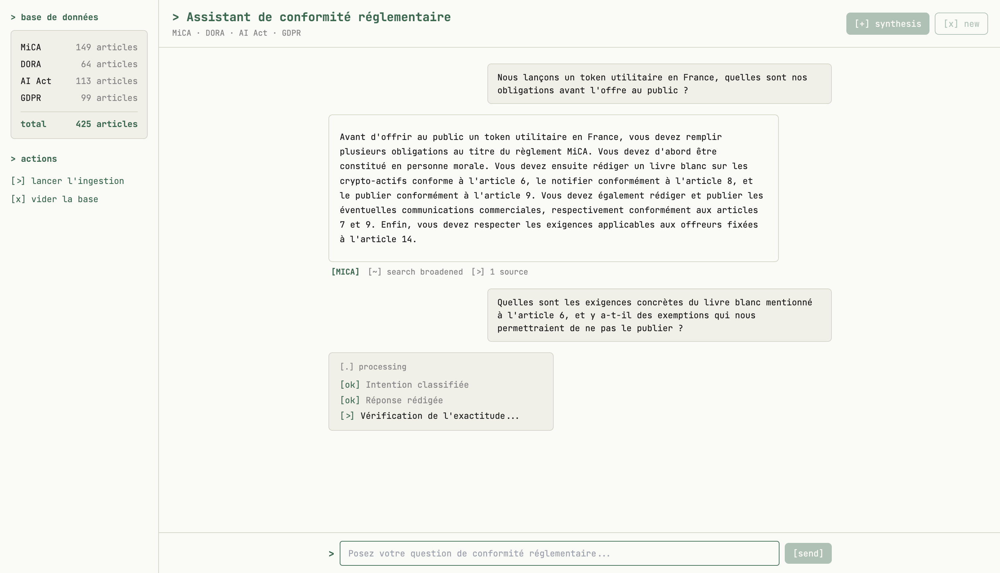
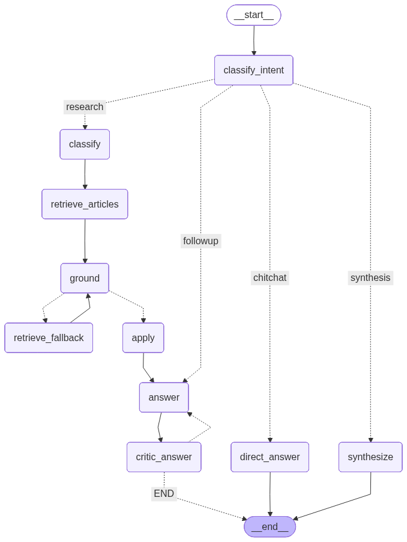

# ⚖️ AI Compliance Assistant, EU Financial Regulation

A retrieval-augmented **agentic assistant** that answers EU compliance questions
(**MiCA · DORA · AI Act · GDPR**) *grounded in the actual regulation text*, not
generic model memory. Every answer is traced back to specific articles, verified
by a self-critique loop, and streamed to the UI step by step.

Built as a full, production-shaped system: a multi-node **LangGraph** agent, a
trained **ML classifier** for regulation routing, **hybrid vector + BM25 retrieval**
over `pgvector`, an **evaluation pipeline** with metrics tracked in **MLflow**,
end-to-end **tracing** with Langfuse, a **test suite** (unit / integration / e2e),
and a **CI pipeline**, all wired together behind a clean hexagonal architecture
and a serving/offline Docker split.

> **Why it exists:** compliance teams can't accept "the model said so." An answer
> like *"you need a white paper under MiCA Article 6"* is only useful if it cites
> the article and can be audited. This system is designed around that constraint.

---

## 🎥 Demo



**Example, real output** for *"Nous lançons un token utilitaire en France, quelles
sont nos obligations avant l'offre au public ?"*:

> Pour lancer un token utilitaire en France, vous devez, avant toute offre au
> public, être constitué en personne morale, rédiger un livre blanc sur les
> crypto-actifs conforme à **l'article 6** du règlement MiCA, le notifier
> (**article 8**), le publier (**article 9**), rédiger et publier les
> communications commerciales (**articles 7 et 9**), et respecter les exigences
> applicables aux offreurs (**article 14**), sauf si l'offre relève d'une
> exemption (offre à moins de 150 personnes par État membre, …).

---

## ✨ Key features

- **Agentic RAG with self-correction:** a LangGraph state machine that classifies
  intent, scopes retrieval to the right regulations, grounds each candidate article,
  applies the law to the user's situation, drafts an answer, then **critiques and
  revises it** (bounded retry loop) before responding.
- **Hybrid retrieval (RRF):** combines dense vector similarity and BM25 keyword
  search via Reciprocal Rank Fusion, deduplicated per-article at the SQL layer.
- **ML regulation router:** a trained multi-label scikit-learn classifier decides
  which regulations a question touches, so retrieval isn't blindly global.
- **Grounded, auditable citations:** answers carry the exact article breadcrumbs
  and supporting excerpts they were built from.
- **Streaming UX:** the API streams node-by-node progress over SSE; the Next.js UI
  renders it as live steps.
- **Evaluation as a first-class citizen:** a DeepEval-based judge scores
  faithfulness, answer relevancy, and context recall/precision, plus latency and
  retry stats, all logged to **MLflow**.
- **Full observability:** one Langfuse trace per request, with every node and LLM
  call nested underneath.
- **Production-shaped ops:** separate lean **serving** image and **jobs** image,
  Docker Compose stack, and a CI pipeline (lint + build + tests on a real pgvector).

---

## 🧠 How the agent works

The core is a LangGraph state machine. A question is first **routed by intent**
(a new research question vs. a follow-up vs. chitchat vs. a synthesis request),
then research questions flow through retrieval, grounding, application, drafting
and critique, with two feedback loops (retrieval fallback, and answer revision).



| Node | Role |
|---|---|
| `classify_intent` | Route the message to research / followup / chitchat / synthesis |
| `classify` | Trained ML model predicts which regulations the question concerns |
| `retrieve_articles` | Hybrid vector + BM25 retrieval, scoped to those regulations |
| `ground` | For each article, judge relevance and extract exact supporting excerpts |
| `retrieve_fallback` | Broaden the search (ignore scope) if nothing was relevant, once |
| `apply` | Analyse how each relevant article applies to the user's situation, note gaps |
| `answer` | Compose the grounded answer, incorporating any critic feedback |
| `critic_answer` | Verify each claim against the findings; flag unsupported ones to trigger a revision |
| `synthesize` | Produce an end-of-conversation compliance report |
| `direct_answer` | Handle chitchat conversationally, without retrieval |

**Guardrails baked into the graph:** the retrieval fallback runs at most once
(`fallback_attempted`), and the answer/critic revision loop is capped at 2 retries,
so neither loop can spin forever.

---

## 🔎 Retrieval, hybrid search with RRF

Articles are chunked, embedded (`openai/text-embedding-3-small`, 1536-dim), and
stored in PostgreSQL + `pgvector`. Retrieval runs **two rankers and fuses them**:

- **Vector search:** cosine distance over chunk embeddings.
- **BM25:** Postgres full-text ranking (`ts_rank` / `plainto_tsquery`, French).
- **Reciprocal Rank Fusion:** blends the two by *rank* (constant `k = 60`), which
  is scale-free, so incomparable raw scores never dominate. Chunks are collapsed to
  one row per article (`GROUP BY article_id`) **before** fusion, so an article with
  many matching chunks can't appear multiple times.

This catches both semantic matches (vector) and exact legal-term matches (BM25),
important when a query names a specific concept like *"livre blanc"* or *"passeport"*.

---

## 🗂️ Regulation classifier

Rather than retrieving across all four regulations for every question, a trained
**multi-label classifier** (TF-IDF + scikit-learn, with per-label thresholds)
predicts the relevant regulation set first. Artifacts live in `models/` and are
loaded once at startup:

```
models/classifier.joblib  vectorizer.joblib  mlb.joblib  thresholds.joblib
```

The training and dataset-generation pipelines are in `src/pipelines/`
(`train_classifier.py`, `generate_classifier_dataset.py`).

---

## 🏛️ Architecture

Hexagonal (ports & adapters): the domain defines interfaces; infrastructure provides
concrete adapters; the application layer orchestrates the agent. Swapping the LLM
provider, vector store, or fetcher is an adapter change, not a rewrite.

```
┌──────────────┐     SSE      ┌──────────────────────────────┐
│  Next.js UI  │ ───────────► │  FastAPI  (serving image)    │
└──────────────┘              │  /chat  /chat/stream         │
                              │  /health  /ingestion/stats   │
                              └───────────────┬──────────────┘
                                              │ LangGraph agent
                              ┌───────────────▼──────────────┐
                              │  PostgreSQL + pgvector        │
                              └───────────────▲──────────────┘
                                              │
   ┌──────────────────────────┐   offline     │        ┌─────────────┐
   │  jobs image              │ ──────────────┘        │  Langfuse   │  ◄─ per-request traces
   │  ingestion · evaluation  │ ─────────────────────► │  MLflow     │  ◄─ eval/ingestion runs
   └──────────────────────────┘                        └─────────────┘
```

### Repository layout

```text
src/
├── api/                    # FastAPI app, routes (chat, stream, health, admin), schemas
├── application/agent/      # LangGraph: State, nodes (intent, retrieval, reasoning, generation), graph wiring
├── domain/
│   ├── models/             # Pydantic domain models (Article, ArticleChunk, EvaluationResult, …)
│   └── ports/              # Abstract interfaces: fetch, chunk, embed, store, judge
├── infrastructure/
│   ├── fetch/              # EUR-Lex fetcher + parser
│   ├── chunk/              # Text chunking adapter
│   ├── embed/              # OpenRouter embedder
│   ├── store/              # PostgreSQL + pgvector repository (hybrid retrieval)
│   └── eval/               # DeepEval judge
├── pipelines/              # ingestion · evaluation · classifier training
└── config/                 # LLM / store / embedder / prompts / Langfuse init
tests/                      # unit · integration · e2e
```

---

## 🛠️ Tech stack

| Area | Choice |
|---|---|
| Agent framework | **LangGraph** (stateful multi-node graph) |
| LLMs | `deepseek/deepseek-v4-flash` via **OpenRouter** (agent / grounder / critic) |
| Embeddings | `openai/text-embedding-3-small` (1536-dim) |
| Vector store | **PostgreSQL + pgvector** (hybrid vector + BM25 / RRF) |
| Regulation routing | **scikit-learn** multi-label classifier (TF-IDF) |
| API | **FastAPI** (async, SSE streaming) |
| UI | **Next.js** / React (streaming progress + PDF export) |
| Evaluation | **DeepEval** judge, **MLflow** tracking |
| Observability | **Langfuse** (nested per-request traces) |
| Packaging | **Docker** (multi-stage: serving + jobs), Docker Compose |
| Tooling | **uv**, **ruff**, **pytest**, GitHub Actions CI |

---

## 🚀 Running it (Docker, recommended)

The whole stack (API + UI + PostgreSQL/pgvector + MLflow) runs via Compose.

```bash
# 1. Configure secrets
cp .env.example .env        # then set OPENROUTER_API_KEY (+ optional Langfuse keys)

# 2. Launch the serving stack
docker compose up -d --build

# 3. Ingest the regulations into the DB (one-time; offline job)
docker compose --profile jobs run --rm jobs main.py index
```

Then open:

| URL | What |
|---|---|
| http://localhost:3000 | Chat UI |
| http://localhost:8000/docs | FastAPI / Swagger |
| http://localhost:5001 | MLflow (eval & ingestion runs) |

> **Note:** step 3 is required before the assistant is useful, retrieval needs
> content. Ingested data persists in a Docker volume across restarts.

### Local (without Docker)

```bash
uv sync
createdb compliance_db && psql compliance_db -f db/init.sql
uv run python main.py index                 # ingest
uv run uvicorn src.api.app:app --reload     # serve API on :8000
```

---

## ⚙️ Offline jobs

Ingestion and evaluation are **offline batch jobs**, not part of the request-serving
path. They run in a separate `jobs` image (which carries the extra ML/eval deps the
lean serving image doesn't).

```bash
# Re-ingest regulations (clears + rebuilds the store, logs per-regulation stats to MLflow)
docker compose --profile jobs run --rm jobs main.py index

# Run the evaluation suite against the labelled dataset (logs metrics to MLflow)
docker compose --profile jobs run --rm jobs main.py eval --dataset datasets/agent-eval/dataset.json
```

The `main.py` CLI also exposes `query` for a single agent run from the terminal.

---

## 📊 Evaluation & experiment tracking

A DeepEval-based judge runs the full agent over a labelled dataset and scores each
answer. Every run is logged to **MLflow** (experiment `compliance-assistant`) with
full reproducibility (git SHA, model names, thresholds, prompt artifacts, and a
render of the graph).

**Metrics tracked**

- **Quality:** faithfulness, answer relevancy, context recall, context precision
  (aggregate + per-question series)
- **Performance:** mean end-to-end latency, **per-node** latency, mean retry count

Ingestion runs are tracked too (experiment `compliance-assistant-ingestion`): a
named metric per regulation for article/chunk counts and durations, plus a
per-regulation breakdown artifact.

<!-- TODO: add a screenshot of the MLflow run comparison view here -->

---

## 👁️ Observability

Each `/chat/stream` request opens a single Langfuse trace (`agent-run`) with **every
LangGraph node and LLM call nested underneath**, so a request is one entry you can
expand into the full execution tree (inputs, outputs, tokens, latency per step).
Set the `LANGFUSE_*` env vars to enable it.

---

## ✅ Testing & CI

A layered test suite (`pytest`), split by marker so each layer runs independently:

```bash
uv run pytest -m unit           # isolated, all external deps mocked
uv run pytest -m integration    # wired against a live pgvector (no real LLM)
uv run pytest -m e2e            # full stack via docker compose (real LLM)
```

- **Unit:** Pydantic model validation; every node's output contract (returns a
  valid partial-State dict, no extra keys, no input mutation); the intent router;
  the regulation classifier (against the real model); the critic's accept/reject
  logic.
- **Integration:** vector insert/retrieve, hybrid RRF ranking, health/readiness,
  and the `/chat` + `/chat/stream` response/SSE contracts.
- **E2E:** real compliance questions end to end, follow-up context retention,
  greetings without citations, and the synthesis report.

**CI** (GitHub Actions) runs on every push: **ruff** lint, then **Docker build** of
both image targets, then **unit + integration** tests against a pgvector service
container. E2E is intentionally kept out of per-PR CI (real LLM means cost +
non-determinism) and is meant for a manual/nightly run instead.

---

## 🏗️ Production considerations (what scaling this would take)

This repo runs the whole system on one machine via Compose. In a real deployment the
three planes separate, and the design already anticipates it:

- **Serving vs. offline** is already split (lean `runtime` image vs. `jobs` image).
  In production the serving image goes to Kubernetes, and ingestion/eval become
  **orchestrated jobs** (Airflow / Dagster) on a schedule, not manual commands.
- **Config & secrets** are injected per-environment (12-factor): service URLs from
  ConfigMaps, keys from a secret manager. The code reads them from env, never
  hardcoded (`localhost` only appears in local Compose).
- **Managed data plane:** RDS/Cloud SQL with pgvector + schema migrations; a central
  MLflow server (Postgres backend + object-store artifacts) behind SSO.
- **LLM gateway:** route model calls through an internal gateway for cost
  attribution, rate limits, caching, and key rotation, with a spend cap.
- **Eval as a deploy gate:** run the eval suite on a golden dataset in CI and block
  a prompt/model change if faithfulness or context-recall regresses.
- **Governance (domain-specific):** because this is regulatory advice, a real
  deployment adds model-risk sign-off, an immutable audit trail (question,
  retrieved articles, answer, model version), human-in-the-loop review, and
  EU data residency.

---

## ⚠️ Limitations

- Answers are **decision support, not legal advice**, always human-reviewed in a
  real setting.
- Coverage is limited to the four regulations currently ingested.
- The admin/ingestion write path is not exposed on the serving API by design; data
  changes go through the offline `jobs` image.

---

## 📁 Supported regulations

| Alias | Regulation | In force |
|---|---|---|
| `mica` | Markets in Crypto-Assets (MiCA) | 2024-12-30 |
| `dora` | Digital Operational Resilience Act (DORA) | 2025-01-17 |
| `ai_act` | EU Artificial Intelligence Act | 2024-08-01 |
| `gdpr` | General Data Protection Regulation (GDPR) | 2018-05-25 |

Source texts are fetched from **EUR-Lex** by CELEX id (see `configs/regulations.yaml`).
